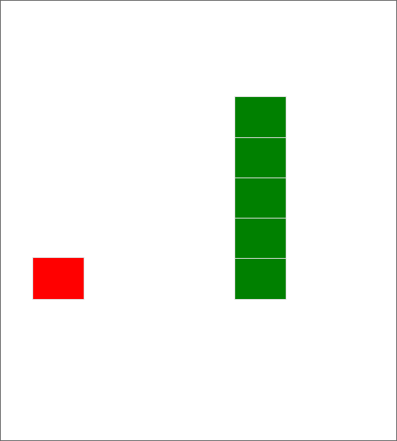
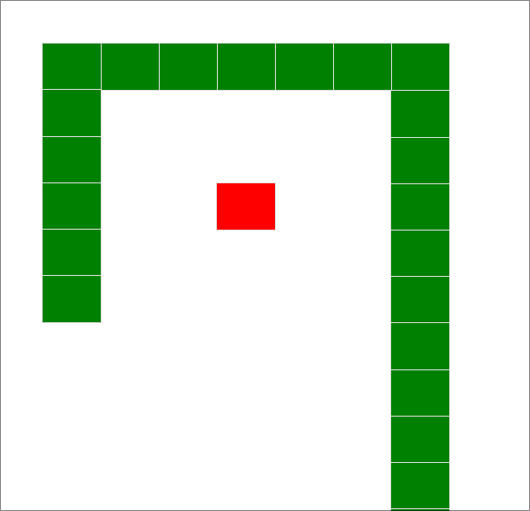
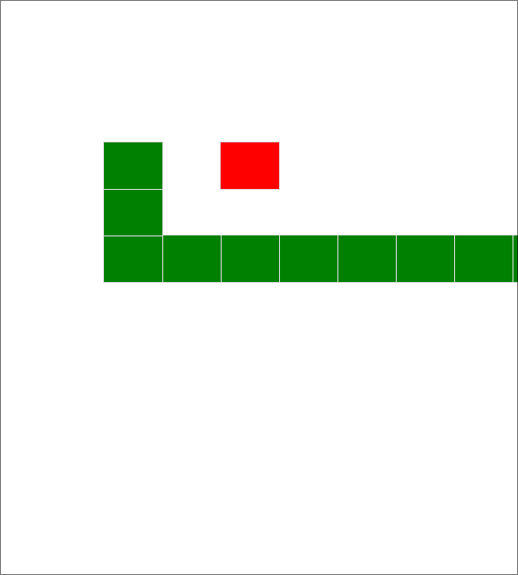

# Sneaky Fun

## Introduction
Sneaky Fun is a classic snake game with a twist! Dive into the challenge of collecting power-ups, facing endless obstacles, and experiencing the unexpected in Sneaky Mode.

## Team
- Developer: Oussama Afnakkar

## Technologies
- HTML5
- CSS3
- JavaScript

## Features

### 1. Sneaky Power-ups

Collect special power-ups for unexpected twists in the game. These power-ups can change the dynamics of the snake, providing new challenges and rewards.

### 2. Endless Challenges

Face increasing difficulty and new challenges as you progress through the game. Keep your reflexes sharp and strategize to overcome obstacles.

### 3. teleport Mode

Activate sneaky mode for a surprise gaming experience. In this mode, the game introduces unexpected elements to keep players on their toes.

## About
This project was inspired by [classic old games]. It is developed as a Portfolio Project for Holberton School.

## Project Links
- [Play Sneaky Fun](https://oussamaafnakkar.github.io/MVP-Snakey-Fun/snf.html)
- [GitHub Repository](https://github.com/oussamaafnakkar/MVP-Snakey-Fun)

## Contribution
If you'd like to contribute or report issues, feel free to open a pull request or submit an issue.
